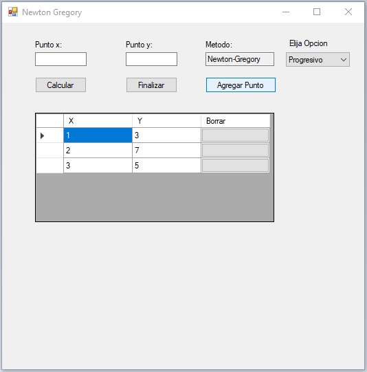

#Instructivo Método Newton Gregory

Seleccionar El método

Colocar valores en x e y y click en "Agregar Punto"

Una vez ingresados todos los puntos , y seleccionada la opción "progresivo/regresivo) click en "Calcular"

Para ver los Li, click en "Mostrar pasos"

Para calcular el valor del polinomio en un punto K, colocar el valor de K en el cuadro correspondiente y click en "Calcular"

